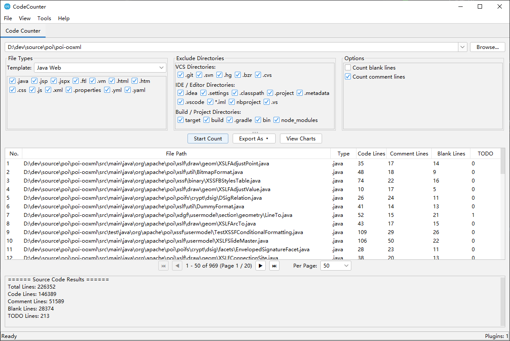

# CodeCounter

[](https://opensource.org/licenses/Apache-2.0)
[](https://openjdk.org/)

🌐 **README in other languages:**
[简体中文](README_zh_CN.md) | [繁體中文](README_zh_TW.md) | [日本語](README_ja.md) | [Español](README_es.md) | [Deutsch](README_de.md) | [Français](README_fr.md) | [Português](README_pt.md)

**CodeCounter** is a powerful source code analysis and statistics tool with a pluggable architecture. It provides comprehensive code counting capabilities for software engineers and teams through an intuitive Swing-based GUI.

---

## 📸 Screenshots



---

## 🎬 Video Tutorial

<video src="https://raw.githubusercontent.com/sparkwan/CodeCounter/refs/heads/master/videos/tutorial.mp4" controls width="800"></video>

> If the video does not play in your browser, you can [download it directly](videos/tutorial.mp4).

---

## ✨ Features

### 📊 Source Code Statistics
The core functionality provides comprehensive code analysis and statistics:

- **Count various line types**: code lines, comment lines, blank lines, and TODO markers
- **Multiple file-type templates**: Java, Java Web, Java Backend, Frontend, Python, Web, and Custom configurations
- **Smart directory exclusion**: Predefined sets for:
  - **Version Control**: `.git`, `.svn`, `.hg`
  - **IDE / Editor**: `.idea`, `.settings`, `.vscode`, `.project`, `.classpath`
  - **Build / Project**: `target`, `build`, `dist`, `node_modules`, `__pycache__`
- **Interactive results**:
  - Paginated table with detailed file-by-file breakdown
  - **Visual charts**: bar chart for file comparison, pie chart for summary statistics
  - **Flexible export options**: CSV, XLSX, PDF (with CJK font support), and Word (DOCX)

### 🔌 Plugin Architecture
CodeCounter is built on a pluggable architecture that allows easy extension:

- **Fully modular design** — add new features without modifying the core system
- **Independent plugin tabs** — each plugin runs in its own tab with dedicated UI
- **Plugin lifecycle management** — proper initialization and shutdown handling
- **Built-in plugins**:
  - **Code Counter** — the main statistics feature

### 🌍 Internationalization (i18n)
Fully localized in **8 languages**:
| Language | |
|---|---|
| English | 🇬🇧 |
| 简体中文 (Simplified Chinese) | 🇨🇳 |
| 繁體中文 (Traditional Chinese) | 🇹🇼 |
| 日本語 (Japanese) | 🇯🇵 |
| Español (Spanish) | 🇪🇸 |
| Deutsch (German) | 🇩🇪 |
| Français (French) | 🇫🇷 |
| Português (Portuguese) | 🇧🇷 |

Language is auto-detected from the OS locale at startup.

### 🎨 Theming
- **Light** and **Dark** themes powered by [FlatLaf](https://www.formdev.com/flatlaf/)
- IntelliJ-style Darcula dark theme
- One-click toggle from the *View* menu

---

## 🚀 Getting Started

### ⚡ Quick Start (Windows)

**Download the latest release:**  https://github.com/sparkwan/CodeCounter/releases/download/Exe/CodeCouter2026.2.28.zip

Simply download and unzip it to a directory of your choice. Then, run `CodeCounter.exe` — no installation required! The executable includes OpenJDK 17, so you don't need Java pre-installed.

### Prerequisites (for building from source)
- **Java 17** or later
- **Maven 3.6+**

### Build from Source
```bash
mvn clean package
```

### Run Locally
```bash
# Option 1: Run the EXE (Windows only, with bundled JRE)
target/CodeCounter.exe

# Option 2: Run the JAR (cross-platform, requires Java 17+)
java -jar target/CodeCounter.jar
```

---

## 🏗️ Project Structure

```
source/
├── pom.xml
├── LICENSE
├── README.md
└── src/
    ├── main/
    │   ├── java/com/github/dev/tool/
    │   │   ├── PluginHostApplication.java       # Main application frame
    │   │   ├── plugin/                           # Plugin framework API
    │   │   │   ├── Plugin.java
    │   │   │   ├── PluginContext.java
    │   │   │   ├── PluginManager.java
    │   │   │   ├── PluginMetadata.java
    │   │   │   ├── PluginPanel.java
    │   │   │   ├── ThemeManager.java
    │   │   │   ├── LocalizationManager.java
    │   │   │   └── impl/                         # Default implementations
│   │   └── plugins/                          # Built-in plugins
│   │       └── counter/                      # Code Counter
    │   └── resources/
    │       ├── i18n/                             # Localization bundles
    │       └── icons/                            # App icons
    └── test/
```

---

## 🔌 Writing a Plugin

1. Implement the `Plugin` interface:

```java
public class MyPlugin implements Plugin {
    @Override public PluginMetadata getMetadata() { ... }
    @Override public void initialize(PluginContext ctx) { ... }
    @Override public void shutdown() { ... }
    @Override public boolean isInitialized() { ... }
    @Override public PluginPanel getPluginPanel() { ... }
}
```

2. Create a `PluginPanel` subclass for the UI.
3. Register the plugin in `PluginHostApplication`.

---

## 🛠️ Tech Stack

| Component | Technology |
|-----------|-----------|
| Language | Java 17 |
| GUI | Swing |
| Look & Feel | FlatLaf 3.2 + IntelliJ Themes |
| Icons | Ikonli (FontAwesome 5) |
| Charts | XChart 3.8.4 |
| Excel Export | Apache POI 5.2.5 |
| PDF Export | Apache PDFBox 2.0.31 |
| Build | Maven |

---

## 📄 License

Licensed under the **Apache License 2.0** — see the [LICENSE](LICENSE) file for details.

```
Copyright 2026 Spark Wan Email: sparkwan  at  gmail.com

Licensed under the Apache License, Version 2.0 (the "License");
you may not use this file except in compliance with the License.
You may obtain a copy of the License at

    http://www.apache.org/licenses/LICENSE-2.0
```

---

## 🤝 Contributing

Contributions are welcome! Feel free to open a Pull Request.

1. Fork the repository
2. Create a feature branch (`git checkout -b feature/my-feature`)
3. Commit your changes (`git commit -m 'Add my feature'`)
4. Push (`git push origin feature/my-feature`)
5. Open a Pull Request

