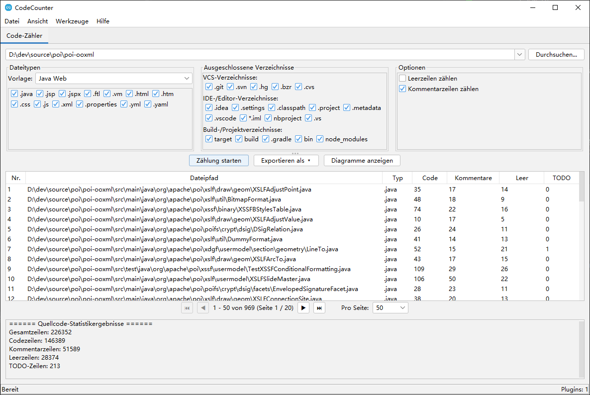

# CodeCounter

[](https://opensource.org/licenses/Apache-2.0)
[](https://openjdk.org/)

🌐 **README in anderen Sprachen:**
[English](README.md) | [简体中文](README_zh_CN.md) | [繁體中文](README_zh_TW.md) | [日本語](README_ja.md) | [Español](README_es.md) | [Français](README_fr.md) | [Português](README_pt.md)

**CodeCounter** ist ein leistungsstarkes Werkzeug zur Quellcode-Analyse und -Statistikerstellung mit Plugin-Architektur. Es bietet umfassende Code-Zählfunktionen für Softwareentwickler und Teams über eine intuitive Swing-basierte GUI.

---

## 📸 Screenshots



---

## 🎬 Video-Tutorial

<video src="videos/tutorial.mp4" controls width="800"></video>

> Falls das Video in Ihrem Browser nicht abgespielt wird, können Sie es [direkt herunterladen](videos/tutorial.mp4).

---

## ✨ Funktionen

### 📊 Quellcode-Statistiken
Die Kernfunktionalität bietet umfassende Code-Analyse und -Statistiken:

- **Zählt verschiedene Zeilentypen**: Codezeilen, Kommentarzeilen, Leerzeilen und TODO-Markierungen
- **Mehrere Dateityp-Vorlagen**: Java, Java Web, Java Backend, Frontend, Python, Web und benutzerdefinierte Konfigurationen
- **Intelligente Verzeichnisausschluss**: Vordefinierte Ausschlussmengen:
  - **Versionskontrolle**: `.git`, `.svn`, `.hg`
  - **IDE / Editor**: `.idea`, `.settings`, `.vscode`, `.project`, `.classpath`
  - **Build / Projekt**: `target`, `build`, `dist`, `node_modules`, `__pycache__`
- **Interaktive Ergebnisanzeige**:
  - Detaillierte Ergebnistabelle mit Paginierung, zeigt Statistiken Datei für Datei
  - **Visuelle Diagramme**: Balkendiagramm für Dateivergleich, Kreisdiagramm für Zusammenfassungsstatistiken
  - **Flexible Exportoptionen**: CSV, XLSX, PDF (mit CJK-Schriftunterstützung), Word (DOCX)

### 🔌 Plugin-Architektur
CodeCounter basiert auf einer Plugin-Architektur, die eine einfache Erweiterung ermöglicht:

- **Vollständig modulares Design** — neue Funktionen hinzufügen ohne Änderung des Kernsystems
- **Unabhängige Plugin-Tabs** — jedes Plugin läuft in einem eigenen Tab mit dedizierter Benutzeroberfläche
- **Plugin-Lebenszyklus-Management** — ordnungsgemäße Initialisierung und Herunterfahren
- **Integrierte Plugins**:
  - **Code-Zähler** — die Hauptstatistikfunktion

### 🌍 Internationalisierung (i18n)
Vollständig lokalisiert in **8 Sprachen**:
| Sprache | |
|---------|---|
| English (Englisch) | 🇬🇧 |
| 简体中文 (Vereinfachtes Chinesisch) | 🇨🇳 |
| 繁體中文 (Traditionelles Chinesisch) | 🇹🇼 |
| 日本語 (Japanisch) | 🇯🇵 |
| Español (Spanisch) | 🇪🇸 |
| Deutsch | 🇩🇪 |
| Français (Französisch) | 🇫🇷 |
| Português (Portugiesisch) | 🇧🇷 |

Die Sprache wird beim Start automatisch aus der Systemsprache erkannt.

### 🎨 Themes
- **Helles** und **dunkles** Theme mit [FlatLaf](https://www.formdev.com/flatlaf/)
- IntelliJ-Style Darcula Dunkles Theme
- Ein-Klick-Umschaltung über das Menü *Ansicht*

---

## 🚀 Erste Schritte

### Voraussetzungen
- **Java 17** oder höher
- **Maven 3.6+**

### Bauen
```bash
mvn clean package
```

### Ausführen
```bash
java -jar target/source-0.0.1-SNAPSHOT.jar
```

---

## 🏗️ Projektstruktur

```
source/
├── pom.xml
├── LICENSE
├── README.md
└── src/
    ├── main/
    │   ├── java/com/github/dev/tool/
    │   │   ├── PluginHostApplication.java       # Hauptanwendungsfenster
    │   │   ├── plugin/                           # Plugin-Framework-API
    │   │   │   ├── Plugin.java
    │   │   │   ├── PluginContext.java
    │   │   │   ├── PluginManager.java
    │   │   │   ├── PluginMetadata.java
    │   │   │   ├── PluginPanel.java
    │   │   │   ├── ThemeManager.java
    │   │   │   ├── LocalizationManager.java
    │   │   │   └── impl/                         # Standardimplementierungen
│   │   └── plugins/                          # Integrierte Plugins
│   │       └── counter/                      # Code-Zähler
    │   └── resources/
    │       ├── i18n/                             # Lokalisierungsdateien
    │       └── icons/                            # Anwendungssymbole
    └── test/
```

---

## 🔌 Plugin-Entwicklung

1. Implementieren Sie das `Plugin`-Interface:

```java
public class MyPlugin implements Plugin {
    @Override public PluginMetadata getMetadata() { ... }
    @Override public void initialize(PluginContext ctx) { ... }
    @Override public void shutdown() { ... }
    @Override public boolean isInitialized() { ... }
    @Override public PluginPanel getPluginPanel() { ... }
}
```

2. Erstellen Sie eine `PluginPanel`-Unterklasse für die Benutzeroberfläche.
3. Registrieren Sie das Plugin in `PluginHostApplication`.

---

## 🛠️ Technologie-Stack

| Komponente | Technologie |
|-----------|-----------|
| Sprache | Java 17 |
| GUI-Framework | Swing |
| Look & Feel | FlatLaf 3.2 + IntelliJ Themes |
| Icons | Ikonli (FontAwesome 5) |
| Diagramme | XChart 3.8.4 |
| Excel-Export | Apache POI 5.2.5 |
| PDF-Export | Apache PDFBox 2.0.31 |
| Build-Tool | Maven |

---

## 📄 Lizenz

Lizenziert unter der **Apache License 2.0** — siehe die [LICENSE](LICENSE)-Datei für Details.

```
Copyright 2026 Spark Wan

Lizenziert unter der Apache License, Version 2.0 (die "Lizenz");
Sie dürfen diese Datei nur in Übereinstimmung mit der Lizenz verwenden.
Eine Kopie der Lizenz erhalten Sie unter

    http://www.apache.org/licenses/LICENSE-2.0
```

---

## 🤝 Mitwirken

Beiträge sind willkommen! Zögern Sie nicht, einen Pull Request einzureichen.

1. Forken Sie das Repository
2. Erstellen Sie Ihren Feature-Branch (`git checkout -b feature/my-feature`)
3. Committen Sie Ihre Änderungen (`git commit -m 'Feature hinzufügen'`)
4. Pushen Sie zum Branch (`git push origin feature/my-feature`)
5. Eröffnen Sie einen Pull Request

