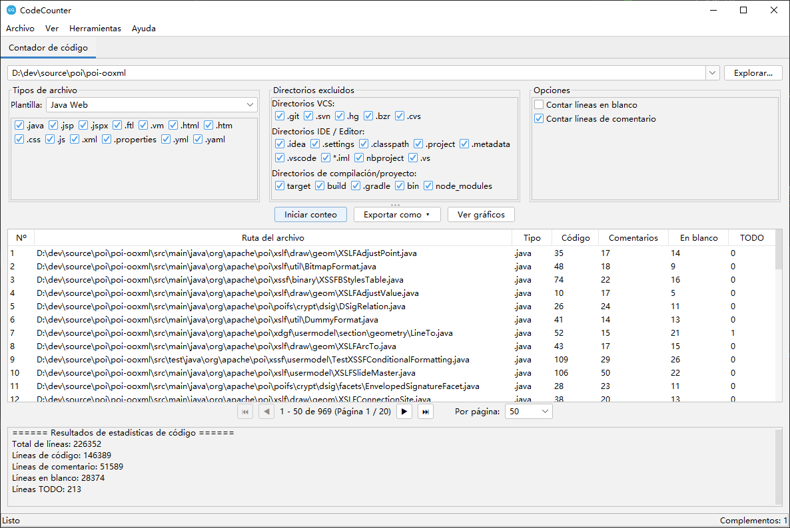

# CodeCounter

[](https://opensource.org/licenses/Apache-2.0)
[](https://openjdk.org/)

🌐 **README en otros idiomas:**
[English](README.md) | [简体中文](README_zh_CN.md) | [繁體中文](README_zh_TW.md) | [日本語](README_ja.md) | [Deutsch](README_de.md) | [Français](README_fr.md) | [Português](README_pt.md)

**CodeCounter** es una poderosa herramienta de análisis y estadísticas de código fuente con arquitectura de plugins. Proporciona capacidades completas de conteo de código para ingenieros de software y equipos a través de una interfaz gráfica Swing intuitiva.

---

## 📸 Capturas de Pantalla



---

## 🎬 Video Tutorial

<video src="videos/tutorial.mp4" controls width="800"></video>

> Si el video no se reproduce en su navegador, puede [descargarlo directamente](videos/tutorial.mp4).

---

## ✨ Características

### 📊 Estadísticas de Código Fuente
La funcionalidad principal ofrece análisis y estadísticas completas del código:

- **Cuenta múltiples tipos de líneas**: líneas de código, líneas de comentarios, líneas en blanco y marcadores TODO
- **Plantillas de múltiples tipos de archivos**: Java, Java Web, Java Backend, Frontend, Python, Web y configuraciones personalizadas
- **Exclusión inteligente de directorios**: Conjuntos predefinidos que incluyen:
  - **Control de versiones**: `.git`, `.svn`, `.hg`
  - **IDE / Editor**: `.idea`, `.settings`, `.vscode`, `.project`, `.classpath`
  - **Construcción / Proyecto**: `target`, `build`, `dist`, `node_modules`, `__pycache__`
- **Visualización de resultados interactiva**:
  - Tabla de resultados detallada con paginación, mostrando estadísticas archivo por archivo
  - **Gráficos visuales**: gráfico de barras para comparación de archivos, gráfico circular para estadísticas de resumen
  - **Opciones de exportación flexibles**: CSV, XLSX, PDF (con soporte de fuentes CJK), Word (DOCX)

### 🔌 Arquitectura de Plugins
CodeCounter está construido sobre una arquitectura de plugins que permite una fácil extensión:

- **Diseño completamente modular** — agregar nuevas funciones sin modificar el sistema central
- **Pestañas de plugins independientes** — cada plugin se ejecuta en su propia pestaña con interfaz dedicada
- **Gestión del ciclo de vida de plugins** — manejo correcto de inicialización y cierre
- **Plugins integrados**:
  - **Contador de Código** — la funcionalidad principal de estadísticas

### 🌍 Internacionalización (i18n)
Completamente localizado en **8 idiomas**:
| Idioma | |
|--------|---|
| English (Inglés) | 🇬🇧 |
| 简体中文 (Chino simplificado) | 🇨🇳 |
| 繁體中文 (Chino tradicional) | 🇹🇼 |
| 日本語 (Japonés) | 🇯🇵 |
| Español | 🇪🇸 |
| Deutsch (Alemán) | 🇩🇪 |
| Français (Francés) | 🇫🇷 |
| Português (Portugués) | 🇧🇷 |

El idioma se detecta automáticamente desde la configuración regional del SO al iniciar.

### 🎨 Temas
- Temas **claro** y **oscuro** con [FlatLaf](https://www.formdev.com/flatlaf/)
- Tema oscuro Darcula estilo IntelliJ
- Cambio con un clic desde el menú *Ver*

---

## 🚀 Primeros pasos

### Requisitos previos
- **Java 17** o superior
- **Maven 3.6+**

### Compilar
```bash
mvn clean package
```

### Ejecutar
```bash
java -jar target/source-0.0.1-SNAPSHOT.jar
```

---

## 🏗️ Estructura del proyecto

```
source/
├── pom.xml
├── LICENSE
├── README.md
└── src/
    ├── main/
    │   ├── java/com/github/dev/tool/
    │   │   ├── PluginHostApplication.java       # Ventana principal
    │   │   ├── plugin/                           # API del framework de plugins
    │   │   │   ├── Plugin.java
    │   │   │   ├── PluginContext.java
    │   │   │   ├── PluginManager.java
    │   │   │   ├── PluginMetadata.java
    │   │   │   ├── PluginPanel.java
    │   │   │   ├── ThemeManager.java
    │   │   │   ├── LocalizationManager.java
    │   │   │   └── impl/                         # Implementaciones por defecto
│   │   └── plugins/                          # Plugins integrados
│   │       └── counter/                      # Contador de código
    │   └── resources/
    │       ├── i18n/                             # Archivos de localización
    │       └── icons/                            # Iconos de la aplicación
    └── test/
```

---

## 🔌 Desarrollo de plugins

1. Implementa la interfaz `Plugin`:

```java
public class MyPlugin implements Plugin {
    @Override public PluginMetadata getMetadata() { ... }
    @Override public void initialize(PluginContext ctx) { ... }
    @Override public void shutdown() { ... }
    @Override public boolean isInitialized() { ... }
    @Override public PluginPanel getPluginPanel() { ... }
}
```

2. Crea una subclase de `PluginPanel` para la interfaz.
3. Registra el plugin en `PluginHostApplication`.

---

## 🛠️ Stack tecnológico

| Componente | Tecnología |
|-----------|-----------|
| Lenguaje | Java 17 |
| Framework GUI | Swing |
| Look & Feel | FlatLaf 3.2 + IntelliJ Themes |
| Iconos | Ikonli (FontAwesome 5) |
| Gráficos | XChart 3.8.4 |
| Exportación Excel | Apache POI 5.2.5 |
| Exportación PDF | Apache PDFBox 2.0.31 |
| Build | Maven |

---

## 📄 Licencia

Licenciado bajo **Apache License 2.0** — consulte el archivo [LICENSE](LICENSE) para más detalles.

```
Copyright 2026 Spark Wan

Licenciado bajo la Licencia Apache, Versión 2.0 (la "Licencia");
no puede usar este archivo excepto en cumplimiento con la Licencia.
Puede obtener una copia de la Licencia en

    http://www.apache.org/licenses/LICENSE-2.0
```

---

## 🤝 Contribuciones

¡Las contribuciones son bienvenidas! No dude en enviar un Pull Request.

1. Haga un fork del repositorio
2. Cree su rama de funcionalidad (`git checkout -b feature/my-feature`)
3. Haga commit de sus cambios (`git commit -m 'Añadir funcionalidad'`)
4. Haga push a la rama (`git push origin feature/my-feature`)
5. Abra un Pull Request

