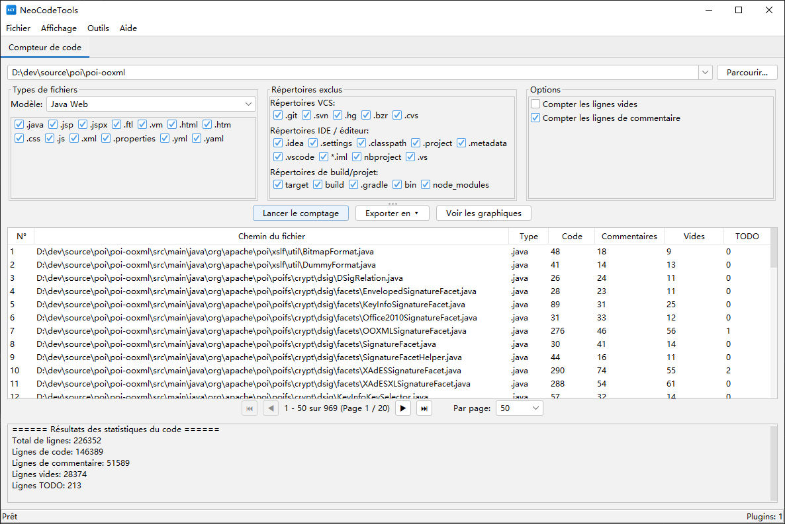

# CodeCounter

[](https://opensource.org/licenses/Apache-2.0)
[](https://openjdk.org/)

🌐 **README dans d'autres langues :**
[English](README.md) | [简体中文](README_zh_CN.md) | [繁體中文](README_zh_TW.md) | [日本語](README_ja.md) | [Español](README_es.md) | [Deutsch](README_de.md) | [Português](README_pt.md)

**CodeCounter** est un puissant outil d'analyse et de statistiques de code source avec une architecture de plugins. Il fournit des capacités complètes de comptage de code pour les ingénieurs logiciels et les équipes via une interface graphique Swing intuitive.

---

## 📸 Captures d'écran



---

## 🎬 Tutoriel Vidéo

<video src="videos/tutorial.mp4" controls width="800"></video>

> Si la vidéo ne se lit pas dans votre navigateur, vous pouvez [la télécharger directement](videos/tutorial.mp4).

---

## ✨ Fonctionnalités

### 📊 Statistiques du Code Source
La fonctionnalité principale offre une analyse et des statistiques complètes du code :

- **Compte plusieurs types de lignes** : lignes de code, lignes de commentaires, lignes vides et marqueurs TODO
- **Modèles de types de fichiers multiples** : Java, Java Web, Java Backend, Frontend, Python, Web et configurations personnalisées
- **Exclusion intelligente de répertoires** : Ensembles prédéfinis incluant :
  - **Contrôle de version** : `.git`, `.svn`, `.hg`
  - **IDE / Éditeur** : `.idea`, `.settings`, `.vscode`, `.project`, `.classpath`
  - **Build / Projet** : `target`, `build`, `dist`, `node_modules`, `__pycache__`
- **Affichage des résultats interactif** :
  - Tableau de résultats détaillé avec pagination, affichant les statistiques fichier par fichier
  - **Graphiques visuels** : graphique en barres pour la comparaison de fichiers, graphique circulaire pour les statistiques de résumé
  - **Options d'export flexibles** : CSV, XLSX, PDF (avec support des polices CJK), Word (DOCX)

### 🔌 Architecture de Plugins
CodeCounter est construit sur une architecture de plugins qui permet une extension facile :

- **Conception entièrement modulaire** — ajouter de nouvelles fonctionnalités sans modifier le système central
- **Onglets de plugins indépendants** — chaque plugin s'exécute dans son propre onglet avec une interface dédiée
- **Gestion du cycle de vie des plugins** — gestion correcte de l'initialisation et de l'arrêt
- **Plugins intégrés** :
  - **Compteur de Code** — la fonctionnalité principale de statistiques

### 🌍 Internationalisation (i18n)
Entièrement localisé en **8 langues** :
| Langue | |
|--------|---|
| English (Anglais) | 🇬🇧 |
| 简体中文 (Chinois simplifié) | 🇨🇳 |
| 繁體中文 (Chinois traditionnel) | 🇹🇼 |
| 日本語 (Japonais) | 🇯🇵 |
| Español (Espagnol) | 🇪🇸 |
| Deutsch (Allemand) | 🇩🇪 |
| Français | 🇫🇷 |
| Português (Portugais) | 🇧🇷 |

La langue est automatiquement détectée à partir des paramètres régionaux du système au démarrage.

### 🎨 Thèmes
- Thèmes **clair** et **sombre** avec [FlatLaf](https://www.formdev.com/flatlaf/)
- Thème sombre Darcula style IntelliJ
- Bascule en un clic depuis le menu *Affichage*

---

## 🚀 Démarrage rapide

### Prérequis
- **Java 17** ou supérieur
- **Maven 3.6+**

### Compiler
```bash
mvn clean package
```

### Exécuter
```bash
java -jar target/source-0.0.1-SNAPSHOT.jar
```

---

## 🏗️ Structure du projet

```
source/
├── pom.xml
├── LICENSE
├── README.md
└── src/
    ├── main/
    │   ├── java/com/github/dev/tool/
    │   │   ├── PluginHostApplication.java       # Fenêtre principale
    │   │   ├── plugin/                           # API du framework de plugins
    │   │   │   ├── Plugin.java
    │   │   │   ├── PluginContext.java
    │   │   │   ├── PluginManager.java
    │   │   │   ├── PluginMetadata.java
    │   │   │   ├── PluginPanel.java
    │   │   │   ├── ThemeManager.java
    │   │   │   ├── LocalizationManager.java
    │   │   │   └── impl/                         # Implémentations par défaut
│   │   └── plugins/                          # Plugins intégrés
│   │       └── counter/                      # Compteur de code
    │   └── resources/
    │       ├── i18n/                             # Fichiers de localisation
    │       └── icons/                            # Icônes de l'application
    └── test/
```

---

## 🔌 Développement de plugins

1. Implémentez l'interface `Plugin` :

```java
public class MyPlugin implements Plugin {
    @Override public PluginMetadata getMetadata() { ... }
    @Override public void initialize(PluginContext ctx) { ... }
    @Override public void shutdown() { ... }
    @Override public boolean isInitialized() { ... }
    @Override public PluginPanel getPluginPanel() { ... }
}
```

2. Créez une sous-classe de `PluginPanel` pour l'interface.
3. Enregistrez le plugin dans `PluginHostApplication`.

---

## 🛠️ Stack technique

| Composant | Technologie |
|-----------|-----------|
| Langage | Java 17 |
| Framework GUI | Swing |
| Look & Feel | FlatLaf 3.2 + IntelliJ Themes |
| Icônes | Ikonli (FontAwesome 5) |
| Graphiques | XChart 3.8.4 |
| Export Excel | Apache POI 5.2.5 |
| Export PDF | Apache PDFBox 2.0.31 |
| Build | Maven |

---

## 📄 Licence

Ce projet est sous licence **Apache License 2.0** — voir le fichier [LICENSE](LICENSE) pour plus de détails.

```
Copyright 2026 Spark Wan

Sous licence Apache, Version 2.0 (la « Licence ») ;
vous ne pouvez utiliser ce fichier qu'en conformité avec la Licence.
Vous pouvez obtenir une copie de la Licence à

    http://www.apache.org/licenses/LICENSE-2.0
```

---

## 🤝 Contribuer

Les contributions sont les bienvenues ! N'hésitez pas à soumettre une Pull Request.

1. Forkez le dépôt
2. Créez votre branche de fonctionnalité (`git checkout -b feature/my-feature`)
3. Committez vos changements (`git commit -m 'Ajouter une fonctionnalité'`)
4. Poussez vers la branche (`git push origin feature/my-feature`)
5. Ouvrez une Pull Request

