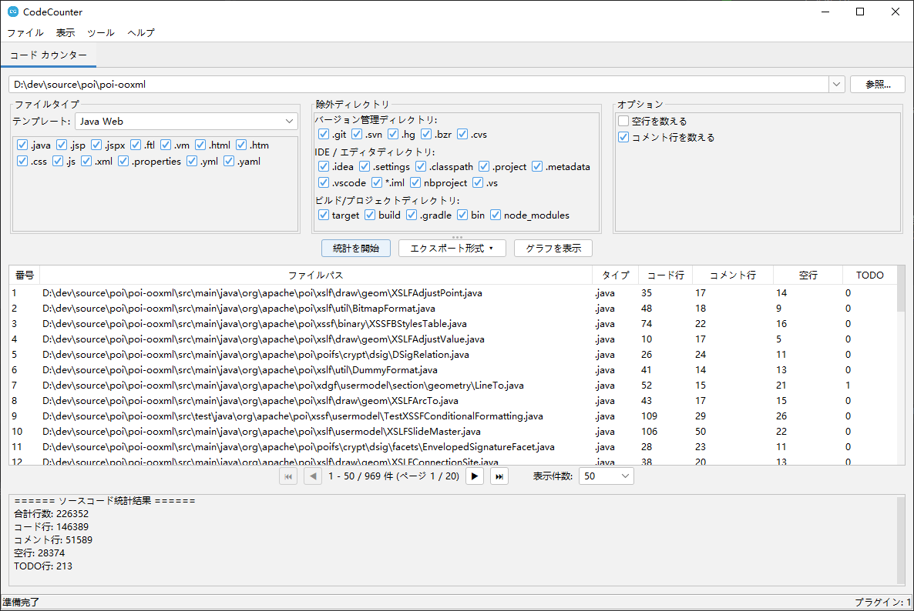

# NeoCodeTools

[](https://opensource.org/licenses/Apache-2.0)
[](https://openjdk.org/)

🌐 **他の言語で読む：**
[English](README.md) | [简体中文](README_zh_CN.md) | [繁體中文](README_zh_TW.md) | [Español](README_es.md) | [Deutsch](README_de.md) | [Français](README_fr.md) | [Português](README_pt.md)

**NeoCodeTools** は、ソフトウェアエンジニアとチームのための無料でモジュール式の拡張可能なデスクトップツールです。プラグイン可能なアーキテクチャに基づき、直感的な Swing ベースの GUI を通じてソースコードの分析・変換ユーティリティを提供します。

---

## 📸 スクリーンショット



---

## 🎬 動画チュートリアル

<video src="videos/tutorial.mp4" controls width="800"></video>

> ブラウザで動画が再生できない場合は、[こちらから直接ダウンロード](videos/tutorial.mp4)できます。

---

## ✨ 機能

### 🔌 プラグインアーキテクチャ
- 完全なプラグイン設計 — コアを変更せずに新しいツールを追加可能
- 各プラグインは独自のタブで独立した UI を持つ
- プラグインのライフサイクル管理（初期化 / シャットダウン）

### 📊 コードカウンタープラグイン
- **コード行**、**コメント行**、**空行**、**TODO** マーカーをカウント
- ファイルタイプテンプレート：Java、Java Web、Java バックエンド、フロントエンド、Python、Web、カスタム
- 除外ディレクトリセットの事前定義：
  - **VCS**：`.git`、`.svn`、`.hg`
  - **IDE / エディタ**：`.idea`、`.settings`、`.vscode`、`.project`、`.classpath`
  - **ビルド / プロジェクト**：`target`、`build`、`dist`、`node_modules`、`__pycache__`
- 結果テーブルの**ページネーション**
- **チャート**：棒グラフ（ファイル比較）と円グラフ（サマリー）
- **エクスポート**：CSV、XLSX、PDF（CJK フォントサポート）、Word（DOCX）

### 🔧 コードフォーマッタープラグイン *（開発中）*
- ソースコードファイルの一括フォーマット

### 📦 パッケージリネームプラグイン *（開発中）*
- プロジェクト全体のパッケージ名 / 名前空間の一括リネーム

### 🌍 国際化（i18n）
**8 言語**を完全サポート：
| 言語 | |
|------|---|
| English（英語） | 🇬🇧 |
| 简体中文（簡体字中国語） | 🇨🇳 |
| 繁體中文（繁体字中国語） | 🇹🇼 |
| 日本語 | 🇯🇵 |
| Español（スペイン語） | 🇪🇸 |
| Deutsch（ドイツ語） | 🇩🇪 |
| Français（フランス語） | 🇫🇷 |
| Português（ポルトガル語） | 🇧🇷 |

起動時に OS のロケールから自動的に言語を検出します。

### 🎨 テーマ
- [FlatLaf](https://www.formdev.com/flatlaf/) による**ライト**と**ダーク**テーマ
- IntelliJ スタイルの Darcula ダークテーマ
- 「表示」メニューからワンクリックで切り替え

---

## 🚀 はじめに

### 前提条件
- **Java 17** 以上
- **Maven 3.6+**

### ビルド
```bash
mvn clean package
```

### 実行
```bash
java -jar target/source-0.0.1-SNAPSHOT.jar
```

---

## 🏗️ プロジェクト構成

```
source/
├── pom.xml
├── LICENSE
├── README.md
└── src/
    ├── main/
    │   ├── java/com/github/dev/tool/
    │   │   ├── PluginHostApplication.java       # メインアプリケーションフレーム
    │   │   ├── plugin/                           # プラグインフレームワーク API
    │   │   │   ├── Plugin.java
    │   │   │   ├── PluginContext.java
    │   │   │   ├── PluginManager.java
    │   │   │   ├── PluginMetadata.java
    │   │   │   ├── PluginPanel.java
    │   │   │   ├── ThemeManager.java
    │   │   │   ├── LocalizationManager.java
    │   │   │   └── impl/                         # デフォルト実装
    │   │   └── plugins/                          # 組み込みプラグイン
    │   │       ├── counter/                      # コードカウンター
    │   │       ├── formatter/                    # コードフォーマッター
    │   │       └── renamer/                      # パッケージリネーム
    │   └── resources/
    │       ├── i18n/                             # 国際化リソース
    │       └── icons/                            # アプリケーションアイコン
    └── test/
```

---

## 🔌 プラグイン開発

1. `Plugin` インターフェースを実装：

```java
public class MyPlugin implements Plugin {
    @Override public PluginMetadata getMetadata() { ... }
    @Override public void initialize(PluginContext ctx) { ... }
    @Override public void shutdown() { ... }
    @Override public boolean isInitialized() { ... }
    @Override public PluginPanel getPluginPanel() { ... }
}
```

2. UI 用の `PluginPanel` サブクラスを作成。
3. `PluginHostApplication` にプラグインを登録。

---

## 🛠️ 技術スタック

| コンポーネント | テクノロジー |
|--------------|------------|
| 言語 | Java 17 |
| GUI フレームワーク | Swing |
| ルック＆フィール | FlatLaf 3.2 + IntelliJ Themes |
| アイコン | Ikonli (FontAwesome 5) |
| チャート | XChart 3.8.4 |
| Excel エクスポート | Apache POI 5.2.5 |
| PDF エクスポート | Apache PDFBox 2.0.31 |
| ビルドツール | Maven |

---

## 📄 ライセンス

**Apache License 2.0** の下でライセンスされています — 詳細は [LICENSE](LICENSE) ファイルをご覧ください。

```
Copyright 2026 Spark Wan

Apache License, Version 2.0（「ライセンス」）に基づいてライセンスされています。
ライセンスに準拠しない限り、このファイルを使用することはできません。
ライセンスのコピーは以下から入手できます：

    http://www.apache.org/licenses/LICENSE-2.0
```

---

## 🤝 コントリビューション

コントリビューションを歓迎します！Pull Request をお気軽にお送りください。

1. リポジトリをフォーク
2. フィーチャーブランチを作成（`git checkout -b feature/my-feature`）
3. 変更をコミット（`git commit -m '機能を追加'`）
4. ブランチにプッシュ（`git push origin feature/my-feature`）
5. Pull Request を作成

