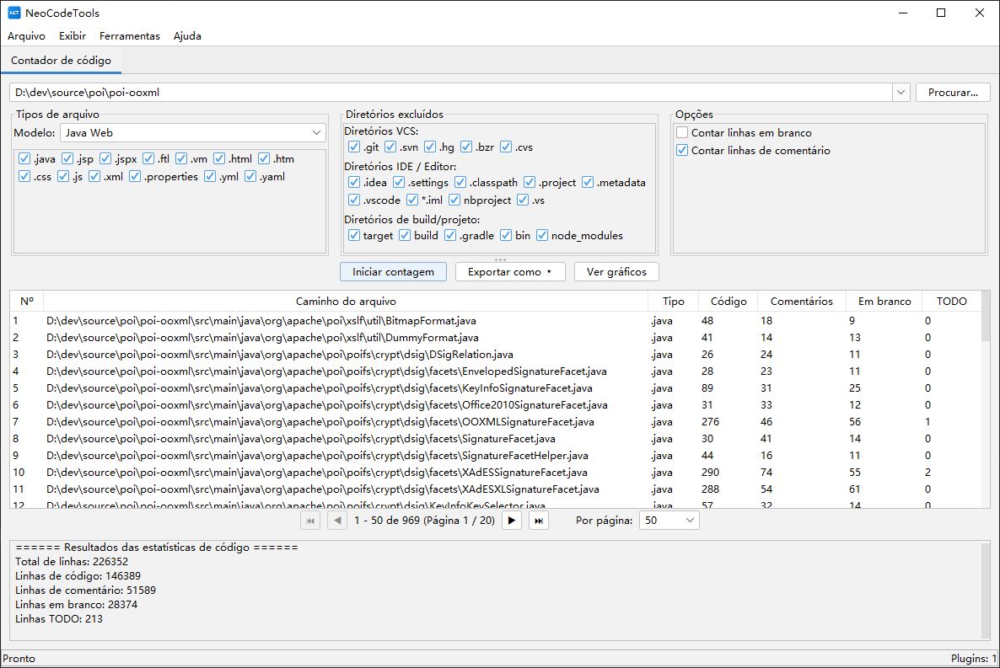

# CodeCounter

[](https://opensource.org/licenses/Apache-2.0)
[](https://openjdk.org/)

🌐 **README em outros idiomas:**
[English](README.md) | [简体中文](README_zh_CN.md) | [繁體中文](README_zh_TW.md) | [日本語](README_ja.md) | [Español](README_es.md) | [Deutsch](README_de.md) | [Français](README_fr.md)

**CodeCounter** é uma ferramenta poderosa de análise e estatísticas de código-fonte com arquitetura de plugins. Ela fornece capacidades completas de contagem de código para engenheiros de software e equipes através de uma interface gráfica Swing intuitiva.

---

## 📸 Capturas de Tela



---

## 🎬 Vídeo Tutorial

<video src="videos/tutorial.mp4" controls width="800"></video>

> Se o vídeo não for reproduzido no seu navegador, você pode [baixá-lo diretamente](videos/tutorial.mp4).

---

## ✨ Funcionalidades

### 📊 Estatísticas de Código-Fonte
A funcionalidade principal oferece análise e estatísticas completas de código:

- **Conta múltiplos tipos de linhas**: linhas de código, linhas de comentários, linhas em branco e marcadores TODO
- **Modelos de tipos de arquivo múltiplos**: Java, Java Web, Java Backend, Frontend, Python, Web e configurações personalizadas
- **Exclusão inteligente de diretórios**: Conjuntos predefinidos incluindo:
  - **Controle de versão**: `.git`, `.svn`, `.hg`
  - **IDE / Editor**: `.idea`, `.settings`, `.vscode`, `.project`, `.classpath`
  - **Build / Projeto**: `target`, `build`, `dist`, `node_modules`, `__pycache__`
- **Exibição de resultados interativa**:
  - Tabela de resultados detalhada com paginação, mostrando estatísticas arquivo por arquivo
  - **Gráficos visuais**: gráfico de barras para comparação de arquivos, gráfico de pizza para estatísticas de resumo
  - **Opções de exportação flexíveis**: CSV, XLSX, PDF (com suporte a fontes CJK), Word (DOCX)

### 🔌 Arquitetura de Plugins
CodeCounter é construído sobre uma arquitetura de plugins que permite fácil extensão:

- **Design completamente modular** — adicionar novas funcionalidades sem modificar o sistema central
- **Abas de plugins independentes** — cada plugin é executado em sua própria aba com interface dedicada
- **Gerenciamento do ciclo de vida dos plugins** — gerenciamento adequado de inicialização e encerramento
- **Plugins integrados**:
  - **Contador de Código** — a funcionalidade principal de estatísticas

### 🌍 Internacionalização (i18n)
Completamente localizado em **8 idiomas**:
| Idioma | |
|--------|---|
| English (Inglês) | 🇬🇧 |
| 简体中文 (Chinês simplificado) | 🇨🇳 |
| 繁體中文 (Chinês tradicional) | 🇹🇼 |
| 日本語 (Japonês) | 🇯🇵 |
| Español (Espanhol) | 🇪🇸 |
| Deutsch (Alemão) | 🇩🇪 |
| Français (Francês) | 🇫🇷 |
| Português | 🇧🇷 |

O idioma é detectado automaticamente a partir da localidade do SO na inicialização.

### 🎨 Temas
- Temas **claro** e **escuro** com [FlatLaf](https://www.formdev.com/flatlaf/)
- Tema escuro Darcula estilo IntelliJ
- Alternância com um clique no menu *Exibir*

---

## 🚀 Primeiros passos

### Pré-requisitos
- **Java 17** ou superior
- **Maven 3.6+**

### Compilar
```bash
mvn clean package
```

### Executar
```bash
java -jar target/source-0.0.1-SNAPSHOT.jar
```

---

## 🏗️ Estrutura do projeto

```
source/
├── pom.xml
├── LICENSE
├── README.md
└── src/
    ├── main/
    │   ├── java/com/github/dev/tool/
    │   │   ├── PluginHostApplication.java       # Janela principal
    │   │   ├── plugin/                           # API do framework de plugins
    │   │   │   ├── Plugin.java
    │   │   │   ├── PluginContext.java
    │   │   │   ├── PluginManager.java
    │   │   │   ├── PluginMetadata.java
    │   │   │   ├── PluginPanel.java
    │   │   │   ├── ThemeManager.java
    │   │   │   ├── LocalizationManager.java
    │   │   │   └── impl/                         # Implementações padrão
│   │   └── plugins/                          # Plugins integrados
│   │       └── counter/                      # Contador de código
    │   └── resources/
    │       ├── i18n/                             # Arquivos de localização
    │       └── icons/                            # Ícones da aplicação
    └── test/
```

---

## 🔌 Desenvolvimento de plugins

1. Implemente a interface `Plugin`:

```java
public class MyPlugin implements Plugin {
    @Override public PluginMetadata getMetadata() { ... }
    @Override public void initialize(PluginContext ctx) { ... }
    @Override public void shutdown() { ... }
    @Override public boolean isInitialized() { ... }
    @Override public PluginPanel getPluginPanel() { ... }
}
```

2. Crie uma subclasse de `PluginPanel` para a interface.
3. Registre o plugin em `PluginHostApplication`.

---

## 🛠️ Stack tecnológico

| Componente | Tecnologia |
|-----------|-----------|
| Linguagem | Java 17 |
| Framework GUI | Swing |
| Look & Feel | FlatLaf 3.2 + IntelliJ Themes |
| Ícones | Ikonli (FontAwesome 5) |
| Gráficos | XChart 3.8.4 |
| Exportação Excel | Apache POI 5.2.5 |
| Exportação PDF | Apache PDFBox 2.0.31 |
| Build | Maven |

---

## 📄 Licença

Licenciado sob a **Apache License 2.0** — consulte o arquivo [LICENSE](LICENSE) para mais detalhes.

```
Copyright 2026 Spark Wan

Licenciado sob a Licença Apache, Versão 2.0 (a "Licença");
você não pode usar este arquivo exceto em conformidade com a Licença.
Você pode obter uma cópia da Licença em

    http://www.apache.org/licenses/LICENSE-2.0
```

---

## 🤝 Contribuições

Contribuições são bem-vindas! Sinta-se à vontade para enviar um Pull Request.

1. Faça um fork do repositório
2. Crie sua branch de funcionalidade (`git checkout -b feature/my-feature`)
3. Faça commit das alterações (`git commit -m 'Adicionar funcionalidade'`)
4. Faça push para a branch (`git push origin feature/my-feature`)
5. Abra um Pull Request

