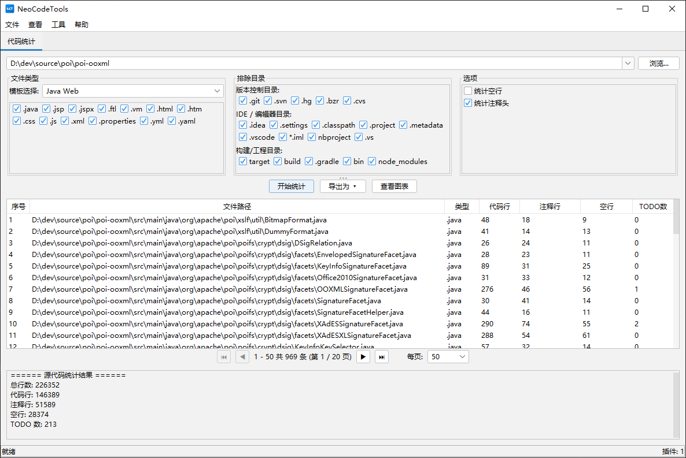

# CodeCounter

[](https://opensource.org/licenses/Apache-2.0)
[](https://openjdk.org/)

🌐 **其他语言版本：**
[English](README.md) | [繁體中文](README_zh_TW.md) | [日本語](README_ja.md) | [Español](README_es.md) | [Deutsch](README_de.md) | [Français](README_fr.md) | [Português](README_pt.md)

**CodeCounter** 是一款功能强大的源代码分析和统计工具，采用插件化架构。它为软件工程师和团队提供了全面的代码统计功能，通过直观的 Swing 界面进行操作。

---

## 📸 截图



---

## 🎬 视频教程

<video src="videos/tutorial.mp4" controls width="800"></video>

> 如果视频无法在浏览器中播放，您可以[直接下载](videos/tutorial.mp4)。

---

## ✨ 功能特性

### 📊 源代码统计
核心功能提供全面的代码分析和统计：

- **统计多种行类型**：代码行、注释行、空行和 TODO 标记
- **多种文件类型模板**：Java、Java Web、Java 后端、前端、Python、Web 和自定义配置
- **智能目录排除**：预定义的排除集包括：
  - **版本控制**：`.git`、`.svn`、`.hg`
  - **IDE / 编辑器**：`.idea`、`.settings`、`.vscode`、`.project`、`.classpath`
  - **构建 / 工程**：`target`、`build`、`dist`、`node_modules`、`__pycache__`
- **交互式结果展示**：
  - 支持分页的详细结果表格，逐文件显示统计信息
  - **可视化图表**：柱状图用于文件对比，饼图显示汇总统计
  - **灵活的导出选项**：CSV、XLSX、PDF（支持中日韩字体）、Word（DOCX）

### 🔌 插件架构
CodeCounter 采用插件化架构，支持轻松扩展：

- **完全模块化设计** — 添加新功能无需修改核心系统
- **独立的插件标签页** — 每个插件在独立标签页中运行，拥有专用 UI
- **插件生命周期管理** — 正确的初始化和关闭处理
- **内置插件**：
  - **代码统计** — 主要的统计功能

### 🌍 国际化（i18n）
完整支持 **8 种语言**：
| 语言 | |
|------|---|
| English（英语） | 🇬🇧 |
| 简体中文 | 🇨🇳 |
| 繁體中文 | 🇹🇼 |
| 日本語（日语） | 🇯🇵 |
| Español（西班牙语） | 🇪🇸 |
| Deutsch（德语） | 🇩🇪 |
| Français（法语） | 🇫🇷 |
| Português（葡萄牙语） | 🇧🇷 |

启动时自动根据操作系统语言环境选择对应语言。

### 🎨 主题切换
- 基于 [FlatLaf](https://www.formdev.com/flatlaf/) 的**浅色**和**深色**主题
- IntelliJ 风格 Darcula 深色主题
- 通过「查看」菜单一键切换

---

## 🚀 快速开始

### 前置条件
- **Java 17** 或更高版本
- **Maven 3.6+**

### 构建
```bash
mvn clean package
```

### 运行
```bash
java -jar target/source-0.0.1-SNAPSHOT.jar
```

---

## 🏗️ 项目结构

```
source/
├── pom.xml
├── LICENSE
├── README.md
└── src/
    ├── main/
    │   ├── java/com/github/dev/tool/
    │   │   ├── PluginHostApplication.java       # 主应用程序窗口
    │   │   ├── plugin/                           # 插件框架 API
    │   │   │   ├── Plugin.java
    │   │   │   ├── PluginContext.java
    │   │   │   ├── PluginManager.java
    │   │   │   ├── PluginMetadata.java
    │   │   │   ├── PluginPanel.java
    │   │   │   ├── ThemeManager.java
    │   │   │   ├── LocalizationManager.java
    │   │   │   └── impl/                         # 默认实现
│   │   └── plugins/                          # 内置插件
│   │       └── counter/                      # 代码统计
    │   └── resources/
    │       ├── i18n/                             # 国际化资源文件
    │       └── icons/                            # 应用图标
    └── test/
```

---

## 🔌 开发插件

1. 实现 `Plugin` 接口：

```java
public class MyPlugin implements Plugin {
    @Override public PluginMetadata getMetadata() { ... }
    @Override public void initialize(PluginContext ctx) { ... }
    @Override public void shutdown() { ... }
    @Override public boolean isInitialized() { ... }
    @Override public PluginPanel getPluginPanel() { ... }
}
```

2. 创建 `PluginPanel` 子类来构建 UI。
3. 在 `PluginHostApplication` 中注册插件。

---

## 🛠️ 技术栈

| 组件 | 技术 |
|------|------|
| 语言 | Java 17 |
| GUI 框架 | Swing |
| 外观主题 | FlatLaf 3.2 + IntelliJ Themes |
| 图标 | Ikonli (FontAwesome 5) |
| 图表 | XChart 3.8.4 |
| Excel 导出 | Apache POI 5.2.5 |
| PDF 导出 | Apache PDFBox 2.0.31 |
| 构建工具 | Maven |

---

## 📄 许可证

本项目基于 **Apache License 2.0** 许可证发布 — 详见 [LICENSE](LICENSE) 文件。

```
Copyright 2026 Spark Wan

根据 Apache License 2.0（"许可证"）许可；
除非遵守许可证条款，否则您不得使用本软件。
您可以在以下地址获取许可证副本：

    http://www.apache.org/licenses/LICENSE-2.0
```

---

## 🤝 参与贡献

欢迎贡献！请随时提交 Pull Request。

1. Fork 本仓库
2. 创建功能分支（`git checkout -b feature/my-feature`）
3. 提交更改（`git commit -m '添加新功能'`）
4. 推送到分支（`git push origin feature/my-feature`）
5. 发起 Pull Request

