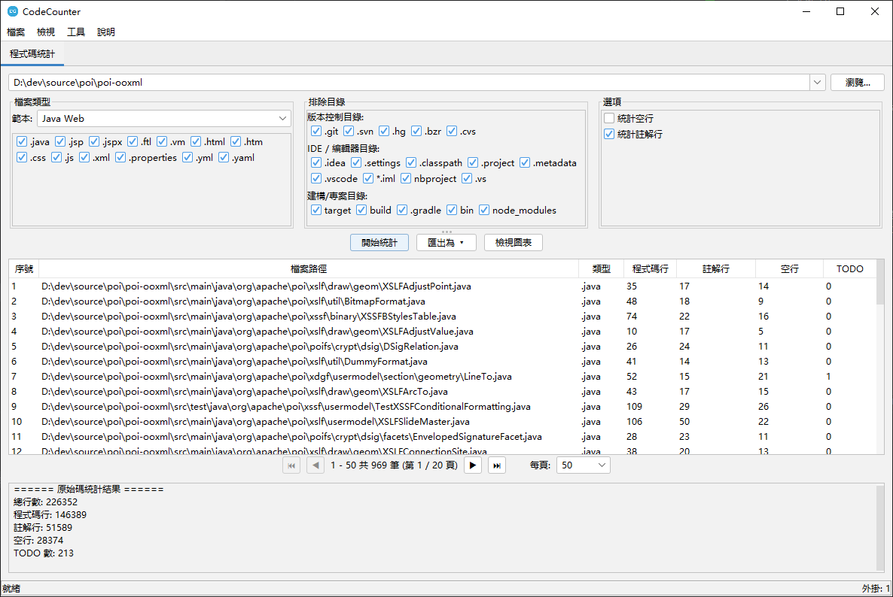

# NeoCodeTools

[](https://opensource.org/licenses/Apache-2.0)
[](https://openjdk.org/)

🌐 **其他語言版本：**
[English](README.md) | [简体中文](README_zh_CN.md) | [日本語](README_ja.md) | [Español](README_es.md) | [Deutsch](README_de.md) | [Français](README_fr.md) | [Português](README_pt.md)

**NeoCodeTools** 是一款免費、模組化、可擴展的桌面工具，專為軟體工程師和團隊打造。基於外掛式架構，透過直覺的 Swing 介面提供一系列原始碼分析和轉換工具。

---

## 📸 截圖



---

## 🎬 影片教學

<video src="videos/tutorial.mp4" controls width="800"></video>

> 若影片無法在瀏覽器中播放，您可以[直接下載](videos/tutorial.mp4)。

---

## ✨ 功能特色

### 🔌 外掛架構
- 完全外掛化設計 — 無需修改核心程式碼即可新增工具
- 每個外掛在獨立頁籤中執行，擁有獨立 UI
- 外掛生命週期管理（初始化 / 關閉）

### 📊 程式碼統計外掛
- 統計**程式碼行**、**註解行**、**空行**和 **TODO** 標記
- 多種檔案類型範本：Java、Java Web、Java 後端、前端、Python、Web 和自訂
- 預定義排除目錄集：
  - **版本控制**：`.git`、`.svn`、`.hg`
  - **IDE / 編輯器**：`.idea`、`.settings`、`.vscode`、`.project`、`.classpath`
  - **建置 / 工程**：`target`、`build`、`dist`、`node_modules`、`__pycache__`
- 結果表格支援**分頁**
- **圖表**：長條圖（檔案對比）和圓餅圖（彙總）
- **匯出**：CSV、XLSX、PDF（支援中日韓字型）、Word（DOCX）

### 🔧 程式碼格式化外掛 *（開發中）*
- 批次格式化原始碼檔案

### 📦 套件名稱重新命名外掛 *（開發中）*
- 批次重新命名專案中的套件名稱 / 命名空間

### 🌍 國際化（i18n）
完整支援 **8 種語言**：
| 語言 | |
|------|---|
| English（英語） | 🇬🇧 |
| 简体中文 | 🇨🇳 |
| 繁體中文 | 🇹🇼 |
| 日本語（日語） | 🇯🇵 |
| Español（西班牙語） | 🇪🇸 |
| Deutsch（德語） | 🇩🇪 |
| Français（法語） | 🇫🇷 |
| Português（葡萄牙語） | 🇧🇷 |

啟動時自動根據作業系統語言環境選擇對應語言。

### 🎨 主題切換
- 基於 [FlatLaf](https://www.formdev.com/flatlaf/) 的**淺色**和**深色**主題
- IntelliJ 風格 Darcula 深色主題
- 透過「檢視」選單一鍵切換

---

## 🚀 快速開始

### 前置條件
- **Java 17** 或更高版本
- **Maven 3.6+**

### 建置
```bash
mvn clean package
```

### 執行
```bash
java -jar target/source-0.0.1-SNAPSHOT.jar
```

---

## 🏗️ 專案結構

```
source/
├── pom.xml
├── LICENSE
├── README.md
└── src/
    ├── main/
    │   ├── java/com/github/dev/tool/
    │   │   ├── PluginHostApplication.java       # 主應用程式視窗
    │   │   ├── plugin/                           # 外掛框架 API
    │   │   │   ├── Plugin.java
    │   │   │   ├── PluginContext.java
    │   │   │   ├── PluginManager.java
    │   │   │   ├── PluginMetadata.java
    │   │   │   ├── PluginPanel.java
    │   │   │   ├── ThemeManager.java
    │   │   │   ├── LocalizationManager.java
    │   │   │   └── impl/                         # 預設實作
    │   │   └── plugins/                          # 內建外掛
    │   │       ├── counter/                      # 程式碼統計
    │   │       ├── formatter/                    # 程式碼格式化
    │   │       └── renamer/                      # 套件名稱重新命名
    │   └── resources/
    │       ├── i18n/                             # 國際化資源檔
    │       └── icons/                            # 應用程式圖示
    └── test/
```

---

## 🔌 開發外掛

1. 實作 `Plugin` 介面：

```java
public class MyPlugin implements Plugin {
    @Override public PluginMetadata getMetadata() { ... }
    @Override public void initialize(PluginContext ctx) { ... }
    @Override public void shutdown() { ... }
    @Override public boolean isInitialized() { ... }
    @Override public PluginPanel getPluginPanel() { ... }
}
```

2. 建立 `PluginPanel` 子類別來建構 UI。
3. 在 `PluginHostApplication` 中註冊外掛。

---

## 🛠️ 技術堆疊

| 元件 | 技術 |
|------|------|
| 語言 | Java 17 |
| GUI 框架 | Swing |
| 外觀主題 | FlatLaf 3.2 + IntelliJ Themes |
| 圖示 | Ikonli (FontAwesome 5) |
| 圖表 | XChart 3.8.4 |
| Excel 匯出 | Apache POI 5.2.5 |
| PDF 匯出 | Apache PDFBox 2.0.31 |
| 建置工具 | Maven |

---

## 📄 授權條款

本專案基於 **Apache License 2.0** 授權條款發佈 — 詳見 [LICENSE](LICENSE) 檔案。

```
Copyright 2026 Spark Wan

根據 Apache License 2.0（「授權條款」）授權；
除非遵守授權條款，否則您不得使用本軟體。
您可以在以下網址取得授權條款副本：

    http://www.apache.org/licenses/LICENSE-2.0
```

---

## 🤝 參與貢獻

歡迎貢獻！請隨時提交 Pull Request。

1. Fork 本倉庫
2. 建立功能分支（`git checkout -b feature/my-feature`）
3. 提交變更（`git commit -m '新增功能'`）
4. 推送到分支（`git push origin feature/my-feature`）
5. 發起 Pull Request

